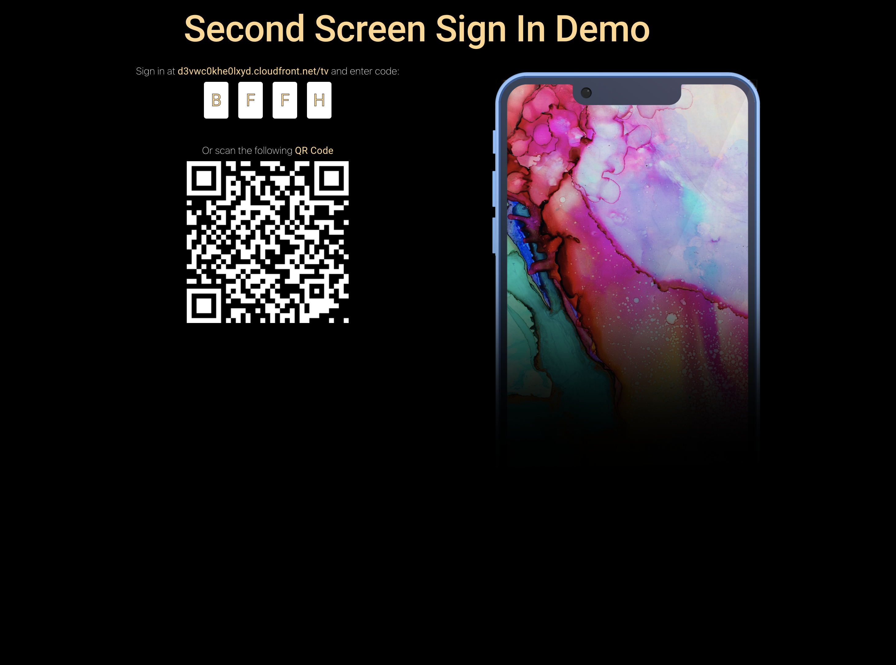
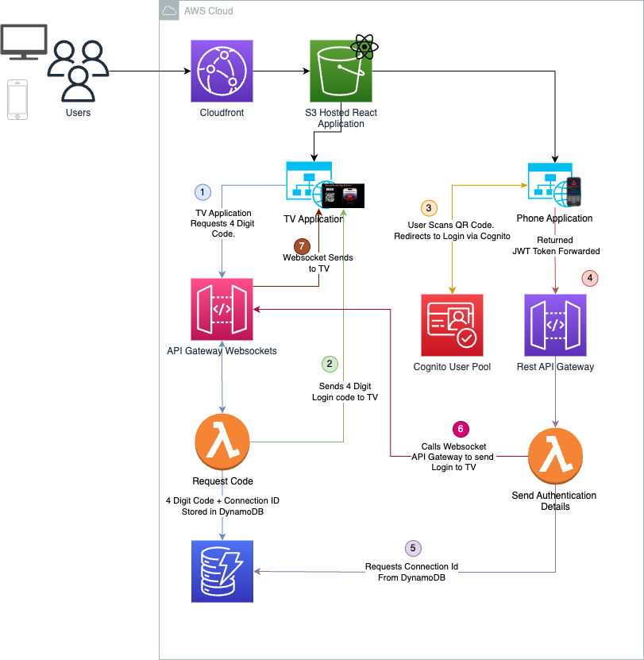

# Second Screen Sign On AWS Demo

## What is it?

Second screen sign on is a complete web application that demonstrates the use of Websockets to allow users to use a second device to login.  Second Screen Sign On is a feature of many web apps, especially those that have TV Apps, that allows the user to sign in from another device, such as a smart phone or laptop, and have the TV Login simulataneously. 

This repository provides all the necessary components to get this running, alongside a CDK application to enable you to deploy it to your AWS Envirionemnt.

## Goal 

The goal of this application is to create a highly available, scalable version of a Second Screen Sign on, one that is pay as you use and can scale to millions of users. 

There will be no functionality beyond the initial second sign on, but we will show some evidence of the user being logged in. 

## Technologies used

* React - For the front end application 
* Barcode.js to generate the QR Code. 
* S3 and Cloudfront for Hosting the WebApp. 
* AWS Cognito for OAuth2 Login and User management. 
* Amazon API Gateway and Websockets for communication between the devices. 
* AWS Lambda
* DynamoDB 
* AWS CDK - Typescript 

## Getting Started Guide. 

A getting started guide can be found [here](./cdk/README.md).

## Demo 

A Demo version can be found here: https://d1r9a1kbg13l5y.cloudfront.net/

## Screenshot

## Architecture 

